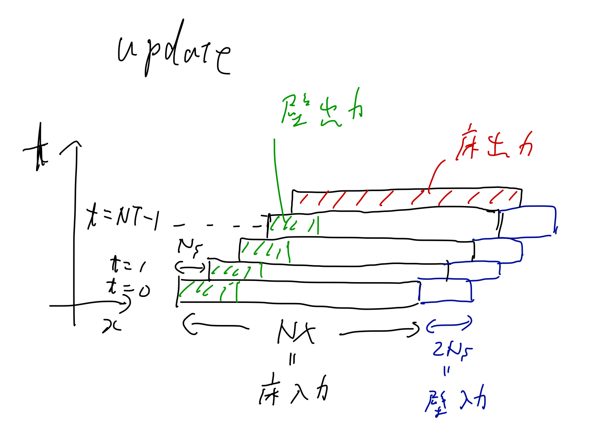

# カーネルとドライバの使用
## 用語と記号の定義

- `T_MAX` まで計算を行う
- Temporal Blockingは `NT` タイムステップをまとめて計算する
- スキームの袖サイズを `Ns` とする
- 1ノードは `LX x LY x LZ` 個の格子点を計算する
- 1ノードには `MX x MY x MZ` 個のブロックがある
- 1ブロックには `NX x NY x NZ` 個の格子点がある
- つまり、 `LX = MX x NX` である
- カーネルは1ブロックをTemporal Blockingして更新する関数である
- ドライバはノード間で通信を行いカーネルを呼びだし1ノード分の格子点を更新する
- コード中では、 `update` 関数がカーネルであり、 `next` 関数がドライバである
- また、 コード中の `step` 関数は1タイムステップ分の更新を行う関数である
- 現在のドライバは `NX = NY = NZ = 2NT` という仮定のもと実装されている
- この仮定は1ノードに確保するブロックの数に関係する

## カーネルの仕様
カーネルは、床と壁を受けとり `NT` タイムステップだけその領域を更新し、入力と同じサイズの床と壁を返す。
データは `param` という構造体を通してドライバとやりとりする。
`param` の定義は以下に通りである。

```cpp
typedef struct {
  // 床の最小座標
  int x_origin;
  int y_origin;
  int z_origin;

  // x,y,z方向のそれぞれの壁
  double rp_wall_x[NT][2*Ns][NY+2*Ns][NZ+2*Ns];
  double up_wall_x[NT][2*Ns][NY+2*Ns][NZ+2*Ns];
  double vp_wall_x[NT][2*Ns][NY+2*Ns][NZ+2*Ns];
  double wp_wall_x[NT][2*Ns][NY+2*Ns][NZ+2*Ns];
  double pp_wall_x[NT][2*Ns][NY+2*Ns][NZ+2*Ns];
  double rp_wall_y[NT][NX+2*Ns][2*Ns][NZ+2*Ns];
  double up_wall_y[NT][NX+2*Ns][2*Ns][NZ+2*Ns];
  double vp_wall_y[NT][NX+2*Ns][2*Ns][NZ+2*Ns];
  double wp_wall_y[NT][NX+2*Ns][2*Ns][NZ+2*Ns];
  double pp_wall_y[NT][NX+2*Ns][2*Ns][NZ+2*Ns];
  double rp_wall_z[NT][NX+2*Ns][NY+2*Ns][2*Ns];
  double up_wall_z[NT][NX+2*Ns][NY+2*Ns][2*Ns];
  double vp_wall_z[NT][NX+2*Ns][NY+2*Ns][2*Ns];
  double wp_wall_z[NT][NX+2*Ns][NY+2*Ns][2*Ns];
  double pp_wall_z[NT][NX+2*Ns][NY+2*Ns][2*Ns];

  double rh_wall_x[NT][2*Ns][NY+2*Ns][NZ+2*Ns];
  double uh_wall_x[NT][2*Ns][NY+2*Ns][NZ+2*Ns];
  double vh_wall_x[NT][2*Ns][NY+2*Ns][NZ+2*Ns];
  double wh_wall_x[NT][2*Ns][NY+2*Ns][NZ+2*Ns];
  double ph_wall_x[NT][2*Ns][NY+2*Ns][NZ+2*Ns];
  double rh_wall_y[NT][NX+2*Ns][2*Ns][NZ+2*Ns];
  double uh_wall_y[NT][NX+2*Ns][2*Ns][NZ+2*Ns];
  double vh_wall_y[NT][NX+2*Ns][2*Ns][NZ+2*Ns];
  double wh_wall_y[NT][NX+2*Ns][2*Ns][NZ+2*Ns];
  double ph_wall_y[NT][NX+2*Ns][2*Ns][NZ+2*Ns];
  double rh_wall_z[NT][NX+2*Ns][NY+2*Ns][2*Ns];
  double uh_wall_z[NT][NX+2*Ns][NY+2*Ns][2*Ns];
  double vh_wall_z[NT][NX+2*Ns][NY+2*Ns][2*Ns];
  double wh_wall_z[NT][NX+2*Ns][NY+2*Ns][2*Ns];
  double ph_wall_z[NT][NX+2*Ns][NY+2*Ns][2*Ns];

  // 出力床をいれる配列
  double rp_res[NX][NY][NZ];
  double up_res[NX][NY][NZ];
  double vp_res[NX][NY][NZ];
  double wp_res[NX][NY][NZ];
  double pp_res[NX][NY][NZ];
  double rh_res[NX][NY][NZ];
  double uh_res[NX][NY][NZ];
  double vh_res[NX][NY][NZ];
  double wh_res[NX][NY][NZ];
  double ph_res[NX][NY][NZ];
} param;
```

カーネルは次のような処理を行う

1. 中間データを保持するためのバッファ(`(NX+2Ns)(NY+2Ns)(NZ+2Ns)` のサイズ)を用意する
2. バッファに入力床(`NX*NY*NZ`)を書きこむ
3. `it` 段目の入力壁 (`x`,`y`,`z`それぞれ)をバッファに書き込む
4. バッファの一部を出力壁として書き出す (壁を保持する配列を上書きする)
5. `step` 関数を呼び、バッファを1タイムステップ更新する
6. 3から5を `NT` 回くりかえす
7. バッファの一部を出力床(`NX*NY*NZ`)として書き出す





## ドライバの仕様
ドライバは、周囲のノードとブロックをやりとりし、適切な床と壁を作成してカーネルを呼びだし、ノード全体を `NT` タイムステップ更新する。

ドライバは次のような処理を行う

1. 中間の床、x方向壁、y方向壁をそれぞれ保持する配列を作る
2. MPI通信をして床を準備する
3. 適切な壁を用意する
4. ブロックのIDの降順に `update` 関数を呼びブロックを更新する
5. x壁とy壁を中間配列へ書き出す
6. 床を中間配列へ書き出す
7. 3-6を `(MX-1)(MY-1)(MZ-1)` ブロック分くりかえす
8. 通信の完了をまって、残りのブロックに対して3-6をくりかえす
9. 中間床を書き出す
10. タイムステップを `NT` 進める

`update` によって空間並進がおきるので注意


